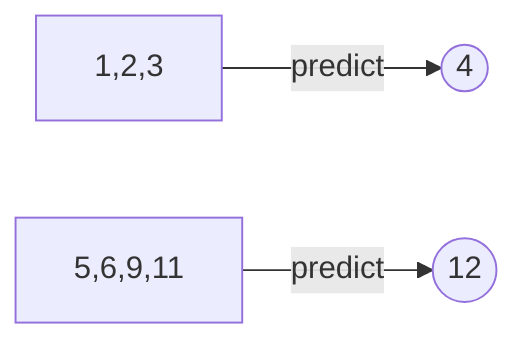

# N-Step Time Series Predictor

### What is time series ?
A **time series** is a series of [data points](http://www.wikizero.biz/index.php?q=aHR0cHM6Ly9lbi53aWtpcGVkaWEub3JnL3dpa2kvRGF0YV9wb2ludA "Data point") indexed (or listed or graphed) in time order. Most commonly, a time series is a [sequence](http://www.wikizero.biz/index.php?q=aHR0cHM6Ly9lbi53aWtpcGVkaWEub3JnL3dpa2kvU2VxdWVuY2U "Sequence") taken at successive equally spaced points in time. Thus it is a sequence of [discrete-time](http://www.wikizero.biz/index.php?q=aHR0cHM6Ly9lbi53aWtpcGVkaWEub3JnL3dpa2kvRGlzY3JldGUtdGltZQ "Discrete-time") data.

for more information: https%3A%2F%2Fen.wikipedia.org%2Fwiki%2FTime_series&usg=AOvVaw2vtOkgXs52GdPvpVCWgJur
### Why should i use this project ?
With this project you can find the most suitable model for your dataset with the number of neurons and lags you have chosen and save it for later uses.  
In addition you can learn the values of n-step ahead of your time series dataset and the autocorrelation coefficient of the lags values you choosed.


> **Note:**
in this project the ***lags*** term my be used in wrong place i will explain it above:
if you set the value of the lags to "1,2,3" the model will get the three values (1,2,3) and predict the next value [predict one value from many values]

***Ex:***


### Usage: 

For installing the required libraries

	$ pip install -r requirements.txt
After that you can start

	$ python N-StepPredictor.py
The supported dataset format is:
````
month;data
1949-01;-213
1949-02;-564
1949-03;-35
1949-04;-15
1949-05;141
1949-06;115
````
 

## Screenshots:


